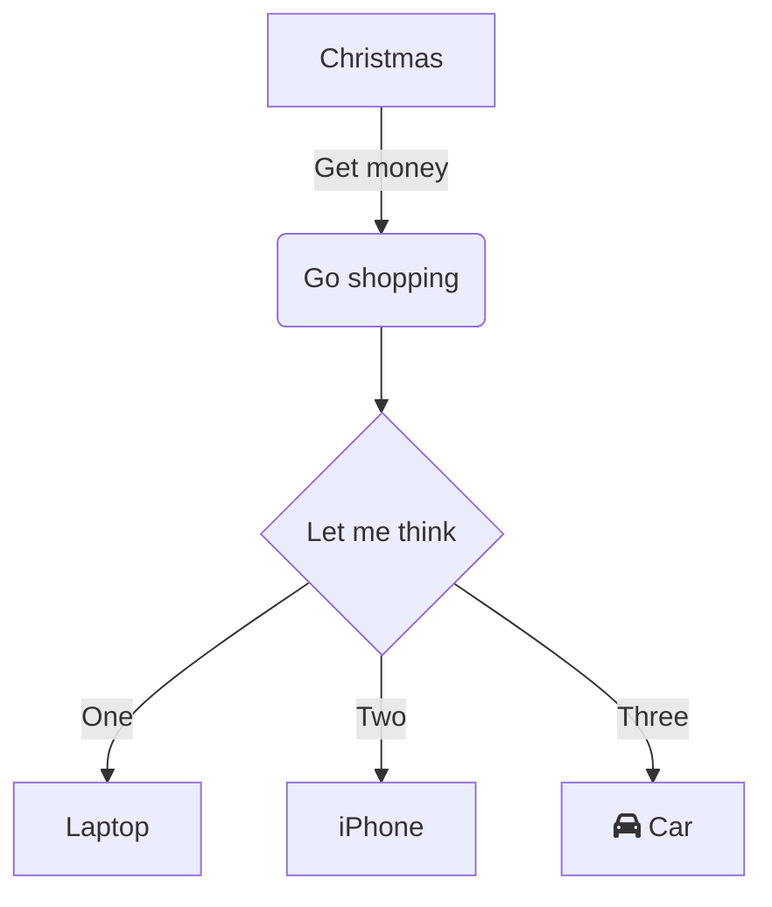
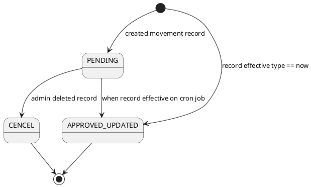
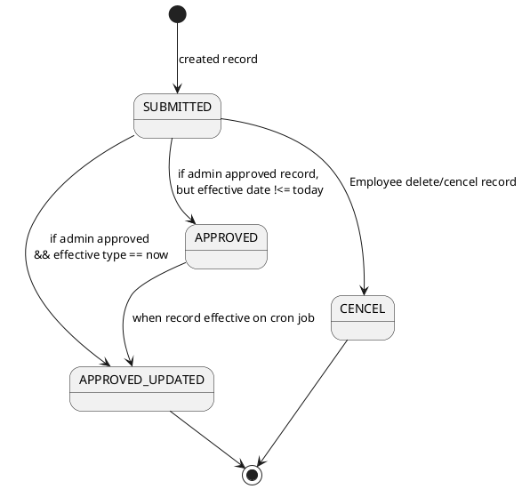
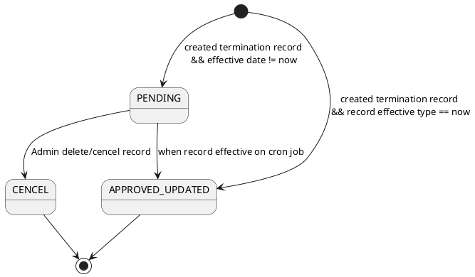
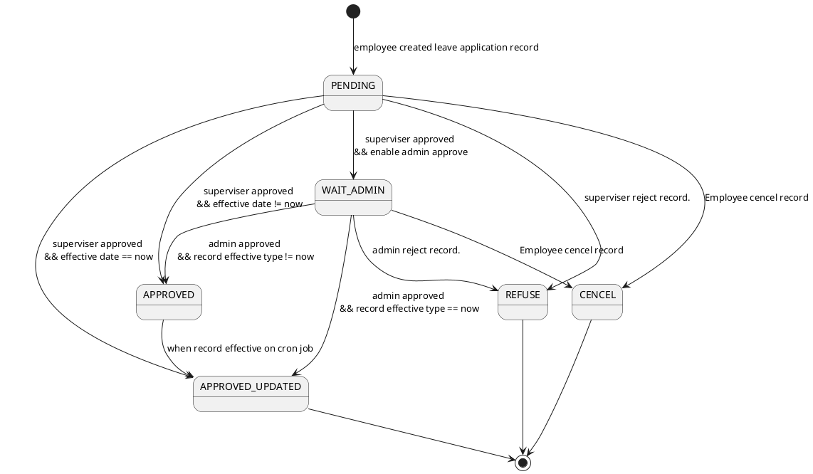
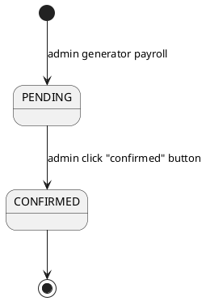
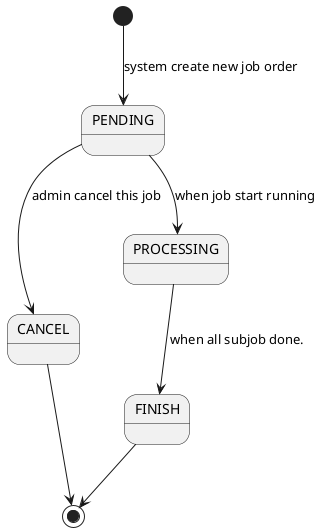

# StayMgt HR 2021 Readme (written by PY)
## 1. Folder Structure
### Tree Diagram
The following folder structure showed notable folder and files which require attention
```
./websys-hr-sm-2021/
├── _references (e.g. .env, readme, shell scripts)
├── database
│   └── data_source (json/image files related to 
├── public
│   ├── css (custom css files)
│   ├── images (custom images)
│   ├── js (custom js scripts)
│   ├── lang (custom langauge/translation files)
│   └── vendor (default 3rd-party packages only)
seeder)
└── resources
    └── views
        ├── errors (default error page view)
        └── layouts (master template files for view)
```

## 2. Licenses
The following folder structure showed notable folder and files which require attention
1. Images
   1. Profile pics (https://generated.photos/)
   2. Cover photo (https://unsplash.com/)
2. Laravel Package
   1. mcamara/laravel-localization (https://github.com/mcamara/laravel-localization)
   2. ColorlibHQ/AdminLTE https://github.com/ColorlibHQ/AdminLTE
   3. owen-it/laravel-auditing (https://github.com/owen-it/laravel-auditing)
   4. joedixon/laravel-translation (https://github.com/joedixon/laravel-translation)
3. Data source
   1. nil
4. Theme
   1. ColorlibHQ/AdminLTE https://github.com/ColorlibHQ/AdminLTE
   2. colorlib-error-404-19 (https://colorlib.com/wp/template/colorlib-error-404-19/)
   3. login-form-v18 (https://colorlib.com/wp/template/login-form-v18/)

## 6. Contribution Guide
> In order to facilitate a team programming environment, please follow the development of best practices:

1. Coding Style 
   1. Laravel follows the PSR-2 coding standard and the PSR-4 autoloading standard.
2. Git Branch Guidelines (https://docs.microsoft.com/en-us/azure/devops/repos/git/git-branching-guidance?view=azure-devops)

## ８. Contact

## ８. Diagram




### 8.1 State Diagram

**Employee Log Status** 

1. Employee Movement



2. Employee Personnel Change



3. Employee Termination



**Leave Application Status**



5. Payroll Status



6. Job order status




# ====================
# ====================
# ====================

# OLD OLD OLD StayMgt 2021 Readme

## 1. Background
1. This is a huge system implementation, in order to get involved with a number of junior programming trainee, we aimed to use a trained source code base, i.e. "fa-db" to develop this project
1. Due to the allocation of the limited resources under the COVID-19, we cannot have the full picture on exactly how the system looks like; the programmer is required to be creative and logical when digesting the documentation.

## 2. Modules
> Here is the list of modules which will be included in the system

### 2.1. Internal Projects

1. [M] Medical-related
   1. [MD] integrate Dental System (iDS)
   2. [MM] integrate Medical System (iMS)
2. [MC] integrate Chinese Medicine System (iCMS)
3. [E] Enterprise Resource Management (ERP)-related
	1. [EA] Accounting System
	1. [EH] Human Resources (HR) System
	1. [EI] Inventory System
	1. [EL] eHealth & Supply Chain System
	1. [EP] Project Management System
4. [C] Social-related
	1. [CM] Membership System
	1. [CR] Property Management System
	1. [CS] School Management System

### 2.2. Client Projects
1. [A] Application-related
	1. [ATF] TF Noodles Sys

## 3. System Design
> Here is the detail of each of the system design

### 3.1. Module Description

#### 3.1.1. Medical-related
##### 3.1.1.1. [MD] integrate Dental System (iDS)
1. Patient Record
1. Appointment
1. Consultation
1. Accounting
1. Drug List
1. Reports
##### 3.1.1.2. [MM] integrate Medical System (iMS)
1. Patient Record
1. Appointment
1. Consultation
1. Accounting
1. Drug List
1. Reports
##### 3.1.1.3. [MC] integrate Chinese Medicine System (iCMS)
1. Patient Record
1. Appointment
1. Consultation
1. Accounting
1. Drug List
1. Reports

#### 3.1.2. Enterprise Resource Management (ERP)-related
##### 3.1.2.1. [EA] Accounting System
1. Book keep (daily entry): record all the daily transactions in one place. DB schema: id, 
1. Balance Sheet
1. Expenses Record
1. Report
##### 3.1.2.2. [EH] Human Resources (HR) System
1. Staff List
1. Payroll
1. Leave Application
1. Appraisal
1. Report
##### 3.1.2.3. [EI] Inventory System
1. Supplier List
1. Inventory Record
1. Report
##### 3.1.2.4. [EL] eHealth & Supply Chain System
1. Insurance
1. Courier List
1. eHealth
1. Report
##### 3.1.2.5. [EP] Project Management System
1. Insurance
1. Courier List
1. eHealth
1. Report

#### 3.1.3. Enterprise Resource Management (ERP)-related
##### 3.1.3.1. [CM] Membership System
1. Event List
1. News List
1. Member List
##### 3.1.3.2. [CR] Property Management System
1. Event List
1. News List
1. Member List
1. Booking List
##### 3.1.3.3. [CS] School Management System
1. School Information
1. Notices List
1. Events List
1. News List
1. Albums

### 3.2. Folder Structure

#### 3.2.1. Controller
Create folder base on the project code and function naming
```
./sm-web-2021/app/Http/Controllers/
├── Api
│   └── Controllers for API call
├── Auth
│   ├── Controllers for Authenication
│   ├── ConfirmPasswordController.php
│   ├── ForgotPasswordController.php
│   ├── LoginController.php
│   ├── RegisterController.php
│   ├── ResetPasswordController.php
│   └── VerificationController.php
├── MD
│   ├── Settings
│   │   └── Settings Controllers for Module [MD]
│   └── Controllers for Module [MD]
├── MM
│   ├── Settings
│   │   └── Settings Controllers for Module [MM]
│   └── Controllers for Module [MM]
├── MC
│   ├── Settings
│   │   └── Settings Controllers for Module [MC]
│   └── Controllers for Module [MC]
├── E
│   └── Duplicated during merge, should clear up
├── EA
│   ├── Settings
│   │   └── Settings Controllers for Module [EA]
│   └── Controllers for Module [EA]
├── EH
│   ├── Settings
│   │   └── Settings Controllers for Module [EH]
│   └── Controllers for Module [EH]
├── EI
│   ├── Settings
│   │   └── Settings Controllers for Module [EI]
│   └── Controllers for Module [EI]
├── EL
│   ├── Settings
│   │   └── Settings Controllers for Module [EL]
│   └── Controllers for Module [EL]
├── EP
│   ├── Settings
│   │   └── Settings Controllers for Module [EP]
│   └── Controllers for Module [EP]
├── CM
│   ├── Settings
│   │   └── Settings Controllers for Module [CM]
│   └── Controllers for Module [CM]
├── CR
│   ├── Settings
│   │   └── Settings Controllers for Module [CR]
│   └── Controllers for Module [CR]
├── System
│   └── Controllers for Global Configurations
└── FADB
    └── All files here are for reference only
```

#### 3.2.2. Model
Folder structure is similar to the Controller
```
./sm-web-2021/app/Http/Models/
├── Auth
│   └── Models for Authenication
├── MD
│   └── Models for Module [MD]
├── MM
│   └── Models for Module [MD]
├── MC
│   └── Models for Module [MC]
├── EA
│   └── Models for Module [EA]
├── EH
│   └── Models for Module [EH]
├── EI
│   └── Models for Module [EI]
├── EL
│   └── Models for Module [EL]
├── EP
│   └── Models for Module [EP]
├── CM
│   └── Models for Module [CM]
├── CR
│   └── Models for Module [CR]
├── System
│   └── Controllers for Global Configurations
├── LaravelCnfigs.php
│   └── strcture to update
└── Panel 
    └── Models for FADB (to be remove)
```
#### 3.2.3. View
Folder structure is similar to the Controller and Model
```
./sm-web-2021/resources/views/
├── archive (FADB, to be remove/transform)
├── external (FADB, to be remove/transform)
├── panel (FADB, to be remove/transform)
├── emails (to be transform)
├── auth (to be transform)
├── layout (to be restrcuture)
├── templates (to be restrcuture)
├── md
├── mm
├── mc
├── ea
├── eh
├── ei
├── el
├── ep
├── cm
├── cr
├── system
├── welcome.blade.php (default, to be remove/transform)
└── Panel 
```

#### 3.2.3. Routing
In addition, the route list also follows the directory structure

1. e.g. Dashboard page
	1. Controller: `Panel\DashboardController@index`
	1. URL: `panel/dashboard`
	1. route name: `route('panel.dashboard.index')`

1. e.g. Book Entry index page
	1. Controller: `Panel\Accounting\BookEntryController@index`
	1. URL: `panel/accounting/book-entry`
	1. route name: `route('panel.accounting.book-entry.index')`

1. e.g. Payroll Create page
	1. Controller: `Panel\Accounting\PayrollController@create`
	1. URL: `panel/accounting/payroll/create`
	1. route name: `route('panel.accounting.payroll.create')`

1. e.g. Staff edit page
	1. Controller: `Panel\Accounting\StaffController@edit`
	1. URL: `panel/accounting/staff/{staff}/edit`
	1. route name: `route('panel.accounting.staff.edit', $s->id)`


## 4. TODO
### 4.1. TODO List
> Here is the list of TODO according to the priority (smaller number higher priority). You should record the TODO ID in the git commit comment

1. [EA01] create a CRUD for the daily entry
1. [EA02] connect EA01 functionality to Expo mobile
1. [EP01] complete the CRUD for the project mgt functionality
1. [EP02] connect EP01 functionality to Expo mobile

### 4.2. TODO Detail
> Here is the detail for the TODO

1. [EA01] you may clone the book-entry controller from [ATF]
1. [EA02] refer to repo XXXX
1. [EP01] refer to the project controller and the project view folders
1. [EP02] refer to repo XXXX, same as EA02

## 5. Servers
> There are two servers for this development project: `production` and `development`

1. Development: https://dev.staymgt.com
	1. https://dev.staymgt.com/sm-web-2021/
	1. git-hook push detection enabled
	1. db schema and data auto-update (to-be-update)
1. Production: https://sys.staymgt.com (under construction)
	1. [MD] https://sys.staymgt.com/ims/
	1. [MM] https://sys.staymgt.com/ims/
	1. [MC] https://sys.staymgt.com/icms/
	1. [EA] https://sys.staymgt.com/accounting/
	1. [EH] https://sys.staymgt.com/hr/
	1. [EI] https://sys.staymgt.com/inventory/
	1. [EL] https://sys.staymgt.com/logistics/
	1. [EP] https://sys.staymgt.com/pm/
	1. [CM] https://sys.staymgt.com/membership/
	1. [CR] https://sys.staymgt.com/property-mgt/

